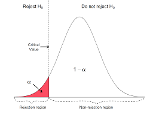
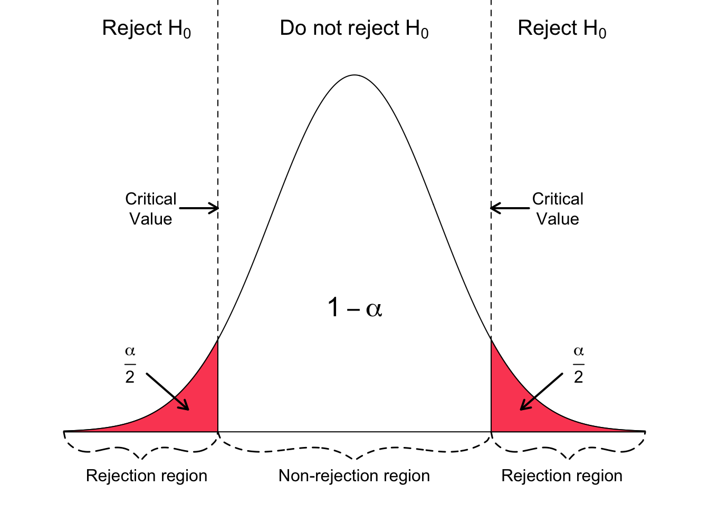
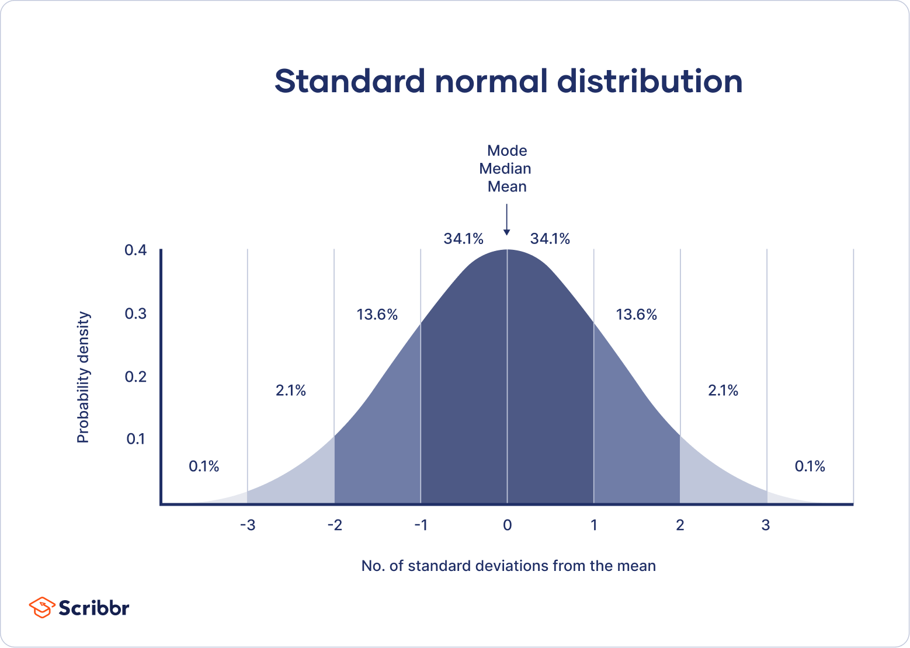
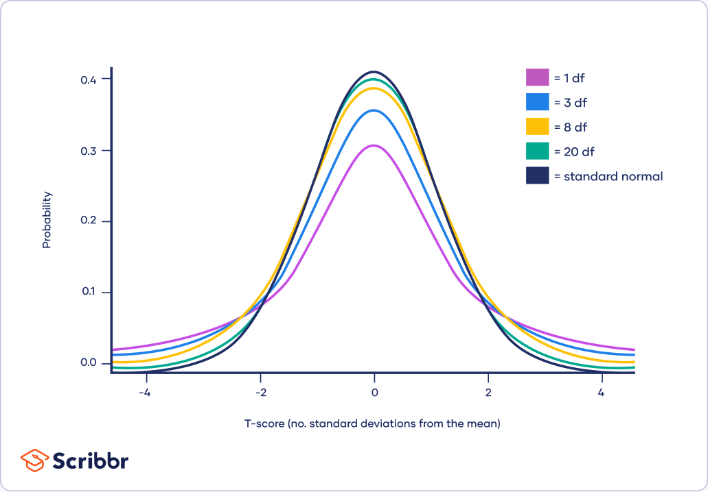

# statistical_analysis_program

## Background

Every academical research has 2 competing hypothesis:
1. null hypothesis (H0) - the effect being studies does not exist and any experimentally observed effect is due to chance alone.  
2. Alternative hypothesis (H1) - the effect being studied exhibit a true phenomenon.
   
Therefore, there is a need in tools to prove that the research findings have statistical significance, meaning the probability to get a certain result or more extreme one (a.k.a the p-value) would be very low, under the assumption the null hypothesis is true.

In order to prove it, the most common method nowdays is to choose an α value, the study's significance level (defined as the probability to reject H0, given H0 is true), which usually chosen to be 5% or lower, depends on the study. The researcher also need to choose the type of tail-test:
1. One-tail test: Specifying direction of the difference between the means,so that H1 states if the popluation's mean is smaller or bigger than the hypothesized mean. Therefore, the rejection region will be placed entirely in one tail of the sampling distribution, either the upper tail (right-sided test) or the lower tail (left-sided test).
   


3. Two-tail test: Not specifying the direction of difference, so that H1 only states that the population's mean is different than the hypothesized mean. Therefore, the rejection region is divided equally between both tails of the sampling distribution.
   


Afterwards, the p-value will be calculated from the data using different tests, intended for different sets of data. The p-value will be compared to α, and the result will be declared as statistically significant, by the standards of the study, if p-value ≤ α.

## Goal of the project

The project is intended to provide a tool that simplifies the statistical analysis stage that comes after an experiment. Insted of writing a program that will analyse the results for each experiment specifically, this program is meant to provide a general tool to different experiments. 

Another goal is to add more tests as time passes in order to enrich the program with as many tools as possible.

Note that the program still requires basic statistical knowledge, in order to to match the right statistical test to the experiment.

This project was originally implemented as part of the [Python programming course](https://github.com/szabgab/wis-python-course-2024-04) at the [Weizmann Institute of Science](https://www.weizmann.ac.il/) taught by [Gabor Szabo](https://szabgab.com/).

## Test types

### 1. Z-test:

* Background: According to the CLT, the sampling distribution of the mean of sample group of n size, will be distributed normally with a mean that equals to the true mean of the population with a std of 𝜎/sqrt(𝑛) (𝜎 is the std of the population).
Under the null hypothesis, we will assume that the mean recived in our experiment is part of the sampling distribution of the population. 
Therefore, if we standardize the mean that was recieved we will get a Z-score, which can be used to calculate the probability to recieve this mean or a more extreme value. This is the p-value, which we will compare to α  that easdeterminted in the beggining of the experiment.If the p-value if smaller than the alpha we could reject the null hypothesis and say that mean recieved is signicantly different from the mean of the population.
$$\frac{x-𝜇}{\frac{𝜎}{\sqrt{n}}}~Z$$

* Use when: Comparing our experiment's mean to the population's one, when the mean and the variance of the population is known.

* Assumptions:
1. Population's mean (μ) and std (σ) are known.
2. The population from which the sample is drawn follow a normal distribution. Alterntively, the sample size is large enough for the sampling distribution of the sample mean to be approximately normal (n ≥ ~30).

### 2. One sample t-test:

* Background: Test which is simillar to the Z-test, however it is used when the variance in the population is not known. Instead, we will evaluate the variance in the population using the variance recieved from the results. Since it adds uncertainty, the sampling distribution of the mean will follow a t-distribution with n-1 degrees of freedom.

* Use when: Comparing our experiment's mean to the population's one, when it is known.

* Assumptions: 
1. Population's mean (μ) is known.
2. The population from which the sample is drawn follow a normal distribution. Alterntively, the sample size is large enough for the sampling distribution of the sample mean to be approximately normal (n ≥ ~30).
3. The observations in the sample must be independent of each other and should not be influenced by or related to other observations.

### 3. Two-sample paired sample t-test:

* Background: Test used for comparing 2 samples groups, in which we can match between each sample in group 1 to sample in group 2. In this case, we can calculate the differences between each pair of samples, and preform a one-sample t-test on the differences' mean, which will be zero most of the times (since the null hypothesis is that there is no effect), using also the variance of the differences. Note that n in this case will be the numbers of pairs.

* Use when: comparing between the means of 2 groups, when it is possible to match between each sample in the first group to a sample in the second group, for example - comparing the effect of a drug before and after consumption.

* Assumptions:
1. The population from which the sample is drawn follow a normal distribution. Alterntively, the sample size is large enough for the sampling distribution of the sample mean to be approximately normal (n ≥ ~30).
2. The observations in the sample must be independent of each other and should not be influenced by or related to other observations.

### 4. Two-sample independent t-test:

* Background: Test used for comparing the means of 2 different sample groups, that cannot be matched. note! In most cases it will be preferable to preform a paired t-test over independent t-test, since this test will have more power (the probability to reject H0 given that H1 is true). In this test we will calculate the difference between the means and will use the weighted average of their variances.

* Use when: Comparing the means of 2 different unmatching groups.

* Assumptions:
1. The population from which the sample is drawn follow a normal distribution. Alterntively, the sample size is large enough for the sampling distribution of the sample mean to be approximately normal (n ≥ ~30).
2. The observations in each group must be independent of each other and should not be influenced by or related to other observations.
3. The variances in the two groups should be equal.

### 5. Pearson correlation:

* Backgorund: Measures the strength and direction of the linear relationship between two variables relatively to their variances. the test checks if those variables change together in a manner that is significant statistically. r is calculated by: 

* Use when: Testing if 2 variables change together significantly.

* Assumptions: 
1. Under H0, the covariance of 2 variables is zero.
2. Both variables should be continuous.
3. Each pair of data points should be independent of each other
4. Both variables should be approximately normally distributed and their joint distribution should be
bivariate normal.
5. The relationship between the two variables should be linear.
6. Homoscedasticity - The variability of one variable should be similar at all values to the variability of the other
variable.
7. No Outliers, since it can disproportionately influence the correlation coefficient, leading to misleading
results.

## The code

1. The program takes as an input a excel/csv file that contains the results of the experiment. For tests 1-2 the program will expect to recieve one column of results and For the remaining tests the program will expect 2 columns of results. The name of the variable should be specified at the top of each column.
2. The progtam will ask which the test the user would like to preform.
3. For tests 1-2, the program will ask for the mean of the population. In test 1 it will also require the variance in population.
4. The progtam will ask for a value for α. For tests 1-4 it will also ask to choose two vs. one tail test.
5. The program will print as an output the p-value of the test, and wether it is able to reject the null hypothesis. For test 5 it will also specify the value of r.

## Install dependencies:

Use the following command:
```
pip install -r requirements.txt
```
## Test the program:

Use the following command:
```
pytest
```
## Run the program:

In order to run the program, you should provide the script's name and the results' file, for example:
```
python statistical_analysis.py experimental_data.xlsx
```
